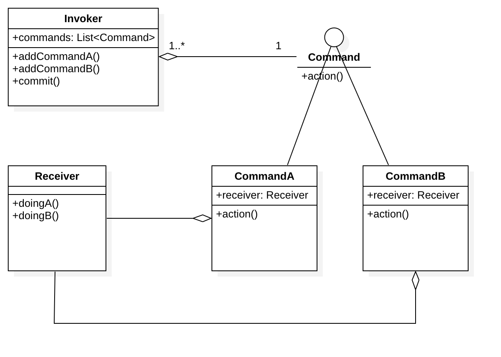

# Design Partterns

## 1.设计模式-命令模式Command
命令模式是对用户输入的命令，进行拦截，批处理等一系列操作，目的是使用户与命令的直接操作对象分离。

####      类图如下：

Command.png

---

	Receiver：命令最终的接受者，执行者；
	Command：命令接口；
	CommandA，CommandB：具体命令，需要持有Receiver的一个引用，从而执行具体命令对应的操作；
	Invoker：命令控制器，调用者，对命令进行拦截批处理等操作。需要持有用户动态设置的命令，以便对这些命令进行处理；

####代码

#####1.Receiver

	public class Receiver {
  
  		/**
   		* 具体操作A
   		*/
  		public void doingA() {
    		System.out.println("doingA!!!");
  		}

  		/**
   		* 具体操作B
   		*/
  		public void doingB() {
    		System.out.println("doingB!!!");
  		}
	}
#####2.Command
	public interface Command {

		/**
		* 执行命令
		*/
		void action();
	}
#####3.CommandA
	public class CommandA implements Command {
		  
		private Receiver receiver;
		
		public CommandA(Receiver receiver) {
		  super();
		  this.receiver = receiver;
		}
		
		@Override
		public void action() {
		  //调用执行动作A
		  this.receiver.doingA();
		}
		
	}

#####4.CommandB
	public class CommandB implements Command {
	  
	  private Receiver receiver;
	
	  public CommandB(Receiver receiver) {
	    super();
	    this.receiver = receiver;
	  }
	
	  @Override
	  public void action() {
	    //调用执行动作B
	    this.receiver.doingB();
	  }
	
	}
#####5.Invoker
	public class Invoker {
	  
	  private List<Command> commands;
	  
	  public Invoker() {
	    super();
	    commands = new ArrayList<Command>();
	  }
	
	  /**
	   * 添加命令A
	   * @param commandA 命令A
	   */
	  public void addCommandA(Command commandA) {
	    this.commands.add(commandA);
	  }
	
	  /**
	   * 添加命令B 虽然addCom mandA 与 addCommandB看上去相同
	   * 如果没有特殊操作可以将这两个命令合并，如果不同命令在添加时
	   * 有额外特别操作需单独放置。
	   * 当然，事例代码是将 addCommandA 和 addCommandA 可以合并的
	   * @param commandB 命令B
	   */
	  public void addCommandB(Command commandB) {
	    this.commands.add(commandB);
	  }
	
	  /**
	   * 命令添加完毕，执行代码
	   */
	  public void commit() {
	    for (Command command : commands) {
	      command.action();
	    }
	  }
	
	}

###测试代码：
	public class Client {
	
	  public static void main(String[] args) {
	    
	    //创建接受者，也就是命令的执行者
	    Receiver receiver = new Receiver();
	    
	    //创建需要添加的命令
	    Command commandA = new CommandA(receiver);
	    Command commandB = new CommandB(receiver);
	    
	    //创建调用者，对命令进行缓存，撤销，批处理等等
	    Invoker invoker = new Invoker();
	    //添加命令
	    invoker.addCommandA(commandA);
	    invoker.addCommandB(commandB);
	    //执行命令
	    invoker.commit();
	  }
	
	}
###执行结果：
	doingA!!!
	doingB!!!
